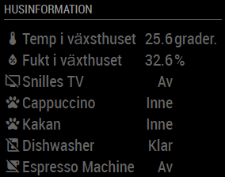

# MMM-homeassistant-sensors
This a module for the [MagicMirror](https://github.com/MichMich/MagicMirror/tree/develop). 
It can display information from [Home Assistant](https://home-assistant.io/) using the home assistant REST API.

## Installation
Navigate into your MagicMirror's `modules` folder and clone this repository:
`cd ~/MagicMirror/modules && git clone https://github.com/Snille/MMM-homeassistant-sensors`

If you want to use icons for the sensors download the `MaterialDesignIcons` webfont from https://github.com/Templarian/MaterialDesign-Webfont/archive/master.zip and unzip the folder:  
`cd ~/MagicMirror/modules/MMM-homeassistant-sensors && wget https://github.com/Templarian/MaterialDesign-Webfont/archive/master.zip && unzip master.zip`

## Configuration
It is very simple to set up this module, a sample configuration looks like this:

## Configuration Options

| Option               | Deafult | Description |
| -------------------- | ------- | ----------- |
| `prettyName`         | `true` | Pretty print the name of each JSON key (remove camelCase and underscores).|
| `stripName`          | `true` | Removes all keys before the printed key. <br><br>**Example:** `a.b.c` will print `c`.|
| `title`              | Home Assistant | Title to display at the top of the module. <br>|
| `host`               | `REQUIRED hassio.local` | The hostname or ip adress of the home assistant instance.|
| `port`               | `8321` | Port of homeassistant e.g. 443 for SSL.|
| `https`              | `REQUIRED false` | Is SSL enabled on home assistant (true/false)|
| `token`              | `REQUIRED` | The long lived token.|
| `updateInterval`     | `300000` | The time between updates (In milliseconds) (300000 = 5 minutes).|
| `selfsigned`         | `false` | Allows self signed certificates/ less secure (true/false).|
| `debuglogging`       | `false` | Enable logging into /home/pi/.pm2/logs/mm-error.log (true/false).|
| `values`             | `[array{}]` | Specify specific values from the json feed to only show what you need (entity_id). <br><br> Check the options!|

## Sensor options
| Option               | Type | Description |
| -------------------- | ---- | ----------- |
| `sensor`             | `entity_id` | Entity ID from Home Assistant. Please have a look at the states pages for the unique `entity_id` of your sensor.|
| `name`               | `string` | You can specify a name that will be displayed instead of the one from HA.
| `defunit`            | `string` | You can specify a unit that will be displayed instead of the one from HA.
| `icons`              | `[array{}]` | Define specific icons for spesific values (see example below). You can use the icon objects from the: [MaterialDesignIcons](https://materialdesignicons.com/). If you downloaded and unpacked them.|
| `replace`            | `[array{}]` | Define spesific values that will be owerriden by these specified values.|

## Sensor icon options
| value                | icon | Description |
| -------------------- | ---- | ----------- |
| `value`              | `icon-name` | You can define a specific icon for a specific value.|
| `default`            | `icon-name` | The default icon for the sensor (if nothing else is specified).|

## Sensor value options
| Value                | New Value | Description |
| -------------------- | --------- | ----------- |
| `value`              | `your new value` | You can define a specific value the will be replaced with a another value.|


Here is an example of an entry in `config.js`
```
{
	module: 'MMM-homeassistant-sensors',
	position: 'top_left',
	config: {
		host: "IP TO HOME ASSISTANT",
		port: "8123",
		https: false,
		token: "YOUR OWN",
		title: 'Husinformation',
		values: [
			{
				sensor: "sensor.greenhouse_temp_and_humid_01_temperature", # The sensor from HA.
				name: "Temp i växsthuset",                                 # New name on the Mirror
				defunit: " grader.",                                       # New Unit as well.
				icons: [{
						"default": "thermometer"                   # Set the default Icon to use.
					}
				],
			},
			{
				sensor: "sensor.greenhouse_temp_and_humid_01_humidity",
				name: "Fukt i växthuset",
				icons: [{
						"default": "water-percent"
					}
				]
			},
			{
				sensor: "media_player.snilles_tv",
				icons: [{
						"default": "television-off",               # Set a default Icon.
						"off": "television-off",                   # Set a specific Icon for value "off".
						"on": "television"                         # Set a specifiv Icon for value "on".
					}
				],
				replace: [{
						"on": "På",                                # Replace the value "on" from the sensor to "På".
						"off": "Av",                               # Replace the value "off" from the sensor to "Av".
						"unknown": "Av"                            # Replace the value "unknown" from the sensor to "Av".
					}
				]
			},
			{
				sensor: "binary_sensor.pet_cappuccino",
				icons: [{
						"off": "paw-off",
						"on": "paw"
					}
				],
				replace: [{
						"on": "Inne",
						"off": "Ute"
					}
				]
			},
			{
				sensor: "binary_sensor.pet_kakan",
				icons: [{
						"off": "paw-off",
						"on": "paw"
					}
				],
				replace: [{
						"on": "Inne",
						"off": "Ute"
					}
				]
			},
			{
				sensor: "binary_sensor.dishwasher",
				icons: [{
						"off": "dishwasher-off",
						"on": "dishwasher"
					}
				],
				replace: [{
						"on": "Diskar",
						"off": "Klar",
					}
				]
			},
			{
				sensor: "binary_sensor.espresso_machine",
				icons: [{
						"off": "coffee-off",
						"on": "coffee"
					}
				],
				replace: [{
						"on": "På",
						"off": "Av"
					}
				]
			}
		]
	}
},
```

**Result** example:



## Special Thanks
- [Michael Teeuw](https://github.com/MichMich) for creating the awesome [MagicMirror2](https://github.com/MichMich/MagicMirror/tree/develop) project that made this module possible.


- [tkoeberl](https://github.com/tkoeberl) for creating the initial module that I used as guidance in creating this module.
