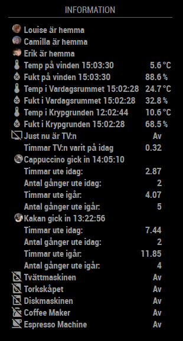
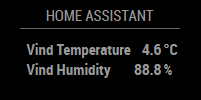
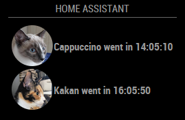
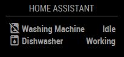

> The NPM module "Request" was removed with Magicmirror `v2.16` This has
> led to the fact that Magicmirror can no longer be started under
> Docker, for example. With this fork, the deprecated npm module
> "Request" is installed locally in the module's directory.


# MMM-homeassistant-sensors

This a module for the [MagicMirror²](https://magicmirror.builders/). 

This module can display information from [Home Assistant](https://home-assistant.io/) using the home assistant REST API.

### Screen shots

[Advanced configuration](#Here-is-the-advanced-configuration).

Using many of the features:

- Adding the "value" to the name.
- Adding time to the name column.
- Hiding the unit it from the "unit" collumn.
- Hiding the value in from the "value" collumn.
- Using "pictures" from the entity.
- Using different "pictures" for different values.
- Using different "icons" for different values from the Material Design Font.
- Replacing "values" with defined values.
- Setting a "default" icon from the Material Design Font.




### Installation

In your terminal, go to your MagicMirror's Module folder:
````
cd ~/MagicMirror/modules
````

Clone this repository:
````
git clone https://github.com/theskyisthelimit/MMM-homeassistant-sensors.git
````

Enter the folder:
````
cd MMM-homeassistant-sensors
````

Install Node-Modules (The [MaterialDesignIcons](https://materialdesignicons.com/) webfont icon names can be used.).
````
npm init
````
&
````
npm install request
````


## Configuration
The configuration can be very simpel, from just displaying a simple value from a senor, to parsing the sensorvalue and changeing it to different pictures depending on the value. It's all up to you.

## Configuration Options
| Option               | Default | Description |
| -------------------- | ------- | ----------- |
| `prettyName`         | `true` | Pretty print the name of each JSON key (remove camelCase and underscores).|
| `stripName`          | `true` | Removes all keys before the printed key. <br><br>**Example:** `a.b.c` will print `c`.|
| `title`              | Home Assistant | Title to display at the top of the module. <br>|
| `host`               | `REQUIRED hassio.local` | The hostname or ip adress of the home assistant instance.|
| `port`               | `8321` | Port of homeassistant e.g. 443 for SSL.|
| `https`              | `REQUIRED false` | Is SSL enabled on home assistant (true/false)|
| `token`              | `REQUIRED` | The long lived token.|
| `fade`               | `100` | When updating the values, this is the time (in milliswconds) the "table" fades out and in again.|
| `updateInterval`     | `300000` | The time between updates (in milliseconds) (300000 = 5 minutes).|
| `controlsensor`      | `sensor control disabled` | The HA sensor you want to use to trigger to show the module when the defined value is present.|
| `controlsensorvalue` | `sensor control disabled` | The value the above HA sensor must have to show the module. A boolean here is a good way to show and hide the module.|
| `displaySymbol`      | `true` | If you don't want either "icons" nor "pictures" in your list, set it to false.|
| `displaydates`       | `false` | If you want to show dates for last update by default. This can be turned off or on for each sensor as well.|
| `displaytimes`       | `false` | If you want to show times for last update by default. This can be turned off or on for each sensor as well.|
| `dateformat`       | `YYYY-MM-DD` | See [moments](https://momentjs.com/docs/#/displaying/) for more date format options.|
| `timeformat`       | `HH:mm:ss` | See [moments](https://momentjs.com/docs/#/displaying/) for more time format options.|
| `rowClass`       | `normal` | Changing the font size, Possible values: `'small'`, `'normal'`, `'big'` <br> Default value: `'small'` |
| `debuglogging`       | `false` | Enable logging into /home/pi/.pm2/logs/mm-error.log (true/false).|
| `values`             | `[array{}]` | Specify specific values from the json feed to only show what you need (entity_id). <br><br> Check the options!|

## Sensor options
| Option               | Type | Description |
| -------------------- | ---- | ----------- |
| `sensor`             | `entity_id` | Entity ID from Home Assistant. Please have a look at the states pages for the unique `entity_id` of your sensor.|
| `name`               | `string` | You can specify a name that will be displayed instead of the one from HA.|
| `devider`            | `number` | You can specify a number (or calculation) that the value should be devided by.|
| `multiplier`         | `number` | You can specify a number (or calculation) that value should be multiplied by.|
| `round`              | `boolean` | true or false if you want to round the value to max two decimals.|
| `displayvalue`       | `boolean` | Set to false to not display the state in the value collumn. |
| `displayvalue`       | `boolean` | Set to false to not display the state in the value collumn. |
| `useValue`           | `false`   | Set this to true to use the sensor value instead of the sensor state|
| `displayunit`        | `boolean` | Set to false to not display the unit in the unit collumn. |
| `defunit`            | `string` | You can specify a unit that will be displayed instead of the one from HA.|
| `highAlertThreshold` | `number` | You can specify a number, if the value/state of the sensor is higher then this the row will blink and turn red.|
| `lowAlertThreshold` | `number` | You can specify a number, if the value/state of the sensor is lower then this the row will blink and turn blue.|
| `icons`              | `[array{}]` | Define specific icons for spesific values/states (see example below). You can use the icon names from the: [MaterialDesignIcons](https://materialdesignicons.com/).|
| `replace`            | `[array{}]` | Define specific values/states that will be owerriden by the specified values.|

### Template options
- Possibility to use %v% in the name and/or unit strings to get the "state" string from the sensor.
- Possibility to use %u% in the name strings to get the "unit" string from the sensor.
- Possibility to use %d% in the name and/or unit strings to get the "last update date" string from the sensor.
- Possibility to use %t% in the name and/or unit strings to get the "last update time" string from the sensor.
- Possibility to use %r% in the name and/or unit strings to get the "last update time" as a readble ("4 hours ago") string from the sensor.
- Possibility to use %m% in the name and/or unit strings to get the "last update time" as a moments string (instead of a the HA string) from the sensor.
- Possibility to use %a% in the name and/or unit and/or replacement value array to get a sensors "address" property. If you use google location sharing you can get the current address of a "device".

## Sensor icon options
| value                | Icon | Description |
| -------------------- | ---- | ----------- |
| `value`              | `icon-name` | You can define a specific [MaterialDesignIcons](https://materialdesignicons.com/) icon or the URL to a picture for a specific value.|
| `default`            | `icon-name` | The default icon for the sensor (if nothing else is specified).|

## Sensor value options
| Value                | New Value | Description |
| -------------------- | --------- | ----------- |
| `value`              | `your new value` | You can define a specific value the will be replaced with this value.|

### Simple configuration
```
{
	module: 'MMM-homeassistant-sensors',
	position: 'top_left',
	config: {
		host: "IP TO HOME ASSISTANT",
		port: "8123",
		https: false,
		token: "YOUR OWN",
		values: [
			{
				sensor: "sensor.vind_temperature",
			},
			{
				sensor: "sensor.vind_humidity",
			},
		]
	}
},
```

### Result 


### Picture configuration for sensors
- Picture changes depending on status (on/off).
- Values are replaced (on/off) to (in/out).
- Adding values and time to the "names" using the "templates" %v% and %t%.
- Hiding the value from the "value" collumn.
```
{
	module: 'MMM-homeassistant-sensors',
	position: 'top_left',
	config: {
		host: "IP TO HOME ASSISTANT",
		port: "8123",
		https: false,
		token: "YOUR OWN",
		values: [
			{
				sensor: "binary_sensor.pet_cappuccino",
				name: "Cappuccino went %v% %t%",
				displayvalue: false,
				icons: [{
						"off": "http://10.0.0.30/img/magicmirror/users/Cappuccino-Out-60x60.png",
						"on": "http://10.0.0.30/img/magicmirror/users/Cappuccino-In-60x60.png"
					}
				],
				replace: [{
						"on": "in",
						"off": "out"
					}
				]
			},
			{
				sensor: "binary_sensor.pet_kakan",
				name: "Kakan went %v% %t%",
				displayvalue: false,
				icons: [{
						"off": "http://10.0.0.30/img/magicmirror/users/Kakan-Out-60x60.png",
						"on": "http://10.0.0.30/img/magicmirror/users/Kakan-In-60x60.png"
					}
				],
				replace: [{
						"on": "in",
						"off": "out"
					}
				]
			},
		]
	}
},
```

### CSS Changes
Added the following to my `custom.css` file.
```
.ha-img {
  height: 60px;
  width: 60px;
}
```

### Result 


### Simple with Icons
- Icon changes depending on status (on/off).
- Values are replaced (on/off) to (Working/Idle).
```
{
	module: 'MMM-homeassistant-sensors',
	position: 'top_left',
	config: {
		host: "IP TO HOME ASSISTANT",
		port: "8123",
		https: false,
		token: "YOUR OWN",
		values: [
			{
				sensor: "binary_sensor.washing_machine",
				name: "Washing Machine",
				icons: [{
						"off": "washing-machine-off",
						"on": "washing-machine"
					}
				],
				replace: [{
						"on": "Working",
						"off": "Idle"
					}
				]
			},
			{
				sensor: "binary_sensor.dishwasher",
				name: "Dishwasher",
				icons: [{
						"off": "dishwasher-off",
						"on": "dishwasher"
					}
				],
				replace: [{
						"on": "Working",
						"off": "Idle"
					}
				]
			},
		]
	}
},
```

### Result 


### Here is the advanced configuration

```
{
	module: 'MMM-homeassistant-sensors',
	position: 'top_left',
	config: {
		host: "IP TO HOME ASSISTANT",
		port: "8123",
		https: false,
		token: "YOUR OWN",
		title: 'Information',
		values: [
			{
				sensor: "device_tracker.360_kidswatch_xplora4",
				name: "Louise är %v%",
				displayvalue: false,
				replace: [{
						"home": "hemma",
						"not_home": "ute",
					}
				]
			},
			{
				sensor: "device_tracker.google_maps_109299643857913851232",
				name: "Camilla är %v%",
				displayvalue: false,
				replace: [{
						"home": "hemma",
						"not_home": "ute",
					}
				]
			},
			{
				sensor: "device_tracker.google_maps_105082325528346759172",
				name: "Erik är %v%",
				displayvalue: false,
				replace: [{
						"home": "hemma",
						"not_home": "ute",
					}
				]
			},
			{
				sensor: "sensor.vind_temperature",
				name: "Temp på vinden %t%",
				icons: [{
						"default": "thermometer"
					}
				]
			},
			{
				sensor: "sensor.vind_humidity",
				name: "Fukt på vinden %t%",
				icons: [{
						"default": "water-percent"
					}
				]
			},
			{
				sensor: "sensor.vardagsrum_temperature",
				name: "Temp i Vardagsrummet %t%",
				icons: [{
						"default": "thermometer"
					}
				]
			},
			{
				sensor: "sensor.vardagsrum_humidity",
				name: "Fukt i Vardagsrummet %t%",
				icons: [{
						"default": "water-percent"
					}
				]
			},
			{
				sensor: "sensor.krypgrund_temperature",
				name: "Temp i Krypgrunden %t%",
				icons: [{
						"default": "thermometer"
					}
				]
			},
			{
				sensor: "sensor.krypgrund_humidity",
				name: "Fukt i Krypgrunden %t%",
				icons: [{
						"default": "water-percent"
					}
				]
			},
			{
				sensor: "media_player.snilles_tv",
				name: "Just nu är TV:n",
				icons: [{
						"default": "television-off",
						"off": "television-off",
						"on": "television"
					}
				],
				replace: [{
						"on": "På",
						"off": "Av",
						"unknown": "Av"
					}
				]
			},
			{
				sensor: "sensor.tv_on_today",
				name: "Timmar TV:n varit på idag",
				defunit: " ",
				},
			{
				sensor: "binary_sensor.pet_cappuccino",
				name: "Cappuccino gick %v% %t%",
				displayvalue: false,
				icons: [{
						"off": "http://10.0.0.30/img/magicmirror/users/Cappuccino-Out-60x60.png",
						"on": "http://10.0.0.30/img/magicmirror/users/Cappuccino-In-60x60.png"
					}
				],
				replace: [{
						"on": "in",
						"off": "ut"
					}
				]
			},
			{
				sensor: "sensor.cappuccinos_outside_time_today",
				name: "Timmar ute idag:",
				defunit: " ",
				replace: [{
						"unknown": "0",
					}
				]
			},
			{
				sensor: "sensor.cappuccinos_trips_outside_today",
				name: "Antal gånger ute idag:",
				defunit: " ",
				replace: [{
						"unknown": "0",
					}
				]
			},
			{
				sensor: "sensor.cappuccino_outside_yesterday",
				name: "Timmar ute igår:",
				defunit: " ",
				replace: [{
						"unknown": "0",
					}
				]
			},
			{
				sensor: "sensor.cappuccinos_trips_outside_yesterday",
				name: "Antal gånger ute igår:",
				defunit: " ",
				replace: [{
						"unknown": "0",
					}
				]
			},
			{
				sensor: "binary_sensor.pet_kakan",
				name: "Kakan gick %v% %t%",
				displayvalue: false,
				icons: [{
						"off": "http://10.0.0.30/img/magicmirror/users/Kakan-Out-60x60.png",
						"on": "http://10.0.0.30/img/magicmirror/users/Kakan-In-60x60.png"
					}
				],
				replace: [{
						"on": "in",
						"off": "ut"
					}
				]
			},
			{
				sensor: "sensor.kakans_outside_time_today",
				name: "Timmar ute idag:",
				defunit: " ",
				replace: [{
						"unknown": "0",
					}
				]
			},
			{
				sensor: "sensor.kakans_trips_outside_today",
				name: "Antal gånger ute idag:",
				defunit: " ",
				replace: [{
						"unknown": "0",
					}
				]
			},
			{
				sensor: "sensor.kakan_outside_yesterday",
				name: "Timmar ute igår:",
				defunit: " ",
				replace: [{
						"unknown": "0",
					}
				]
			},
			{
				sensor: "sensor.kakans_trips_outside_yesterday",
				name: "Antal gånger ute igår:",
				defunit: " ",
				replace: [{
						"unknown": "0",
					}
				]
			},
			{
				sensor: "binary_sensor.washing_machine",
				name: "Tvättmaskinen",
				icons: [{
						"off": "washing-machine-off",
						"on": "washing-machine"
					}
				],
				replace: [{
						"on": "På",
						"off": "Av"
					}
				]
			},
			{
				sensor: "binary_sensor.drying_cabinet",
				name: "Torkskåpet",
				icons: [{
						"off": "tumble-dryer-off",
						"on": "tumble-dryer"
					}
				],
				replace: [{
						"on": "På",
						"off": "Av"
					}
				]
			},
			{
				sensor: "binary_sensor.dishwasher",
				name: "Diskmaskinen",
				icons: [{
						"off": "dishwasher-off",
						"on": "dishwasher"
					}
				],
				replace: [{
						"on": "På",
						"off": "Av"
					}
				]
			},
			{
				sensor: "binary_sensor.coffee_maker",
				icons: [{
						"on": "kettle",
						"off": "kettle-off"
					}
				],
				replace: [{
						"on": "På",
						"off": "Av"
					}
				]
			},
			{
				sensor: "binary_sensor.espresso_machine",
				icons: [{
						"off": "coffee-off",
						"on": "coffee"
					}
				],
				replace: [{
						"on": "På",
						"off": "Av"
					}
				]
			}
		]
	}
},
```

## Special Thanks
- [Michael Teeuw](https://github.com/MichMich) for creating the awesome [MagicMirror2](https://github.com/MichMich/MagicMirror/tree/develop) project that made this module possible.
- [tkoeberl](https://github.com/tkoeberl) for creating the initial module that I used as guidance in creating this module.
